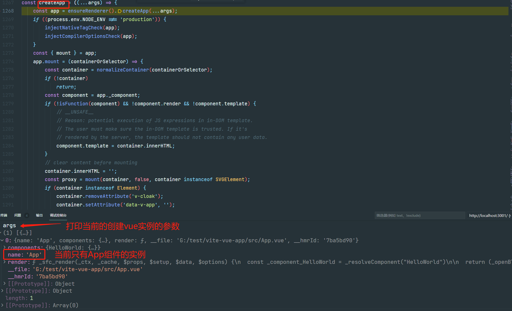
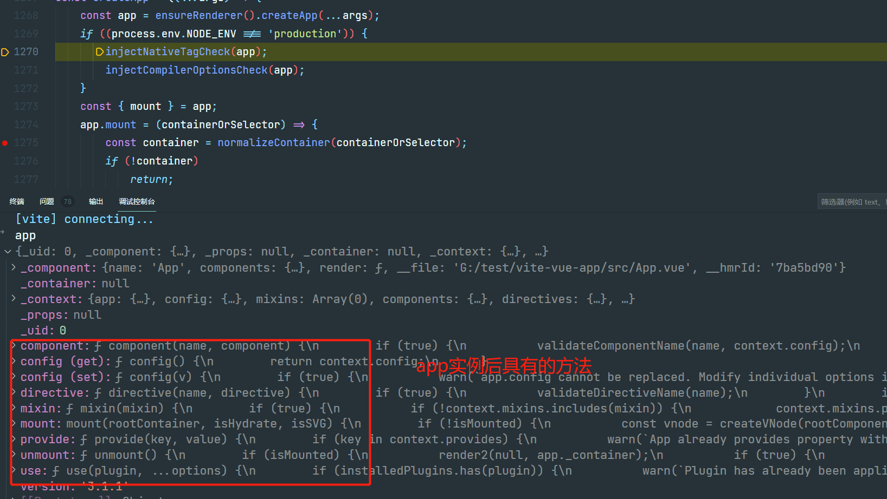

# createApp创建过程解析

## 起步

### 初始化一个vue3项目

首先，我们用vite创建一个简单的vue3的项目

```bash
yarn create vite my-vue-app --template vue
```

我们都知道的vue3基础用法，比如以下 `main.js` 的内容

```javascript
import { createApp } from 'vue'
import App from './App.vue'
const app = createApp(App)
app.mount('#app')

// 组件渲染和未捕获错误配置的处理程序
app.config.errorHandler = (err, vm, info) => {}
// 添加全局属性
app.config.globalProperties.$http = () => {} // 这里相当于挂载到Vue2的 Vue.prototype
// 指定一种方法识别Vue之外定义的自定义元素
app.config.isCustomElement = tag => tag.startsWith('ion-')
// 注册组件
app.component('my-component', {})
// 检索组件
const MyComponent = app.component('my-component')
// 注册指令
app.directive('my-directive',{})
// 设置一个可以注入到应用程序内所有组件中的值。组件应使用inject来接收提供的值。
app.provide('user', 'administrator')
// 卸载应用程序
 app.unmount()
// 安装vue插件
import MyPlugin from './plugins/MyPlugin'
app.use(MyPlugin)
...
```

那么createApp是做了什么呢，是怎么样把虚拟DOM转换成真实DOM的呢？

## createApp的过程

首先放一张完整的流程图，先有一个印象：


### createApp源码分析

分析过程请看如下代码注释

```javascript
const createApp = ((...args) => {
  // 核心方法 调用vue实例创建方法创建app实例
  const app = ensureRenderer().createApp(...args);
  if ((process.env.NODE_ENV !== 'production')) {
    // 用于注入native标签
    injectNativeTagCheck(app);
    // 注入用户自己的自定义标签
    injectCompilerOptionsCheck(app);
  }
  const { mount } = app;
  // app实例的挂载方法 对应 app.mount('#app') 接受的是我们传入需要挂载的选择器
  app.mount = (containerOrSelector) => {
    // 拿到选择器的节点 此处拿到的是 HTMLElement 
    const container = normalizeContainer(containerOrSelector);
    if (!container) return;
    // 此处是实例化的 App组件
    const component = app._component;
    if (!isFunction(component) && !component.render && !component.template) {
      // __UNSAFE__
      // Reason: potential execution of JS expressions in in-DOM template.
      // The user must make sure the in-DOM template is trusted. If it's
      // rendered by the server, the template should not contain any user data.
      component.template = container.innerHTML;
    }
    // 在挂载之前 先清空容器的内容
    container.innerHTML = '';
    // 调用 createVNode 返回一个响应式的 vnode
    const proxy = mount(container, false, container instanceof SVGElement);
    if (container instanceof Element) {
      container.removeAttribute('v-cloak');
      container.setAttribute('data-v-app', '');
    }
    return proxy;
  };
  return app;
});
```

通过上面源码解析，我们可以看出 createApp 主要是干了两件事：

- 创建 app 实例，并返回该实例

- 重写 mount 方法

看完会存在两个主要疑问，ensureRenderer 是干啥用的？为什么要重写 mount 方法，而不直接使用呢？

此处我们首先看看 传入 `args`:



实例化后的app具有的方法包含，`app.component()` 挂载组件方法、 `app.config` 全局配置属性、`app.mixin()` 挂载mixin方法、`app.provide()`根部注入属性方法、`app.use()`挂载插件的方法、`app.mount()`实例挂载节点容器方法、`app.unmount()` 卸载方法



### ensureRenderer

用于创建渲染器，渲染器核心代码处于 runtime-core/src/renderer.ts  文件。看看ensureRenderer().createApp 做了哪些操作:

```javascript
baseCreateRenderer// 可以看出render存在2种类型的渲染器
let renderer: Renderer<Element> | HydrationRenderer

// 延迟创建渲染器，当用户只是使用reactive响应库，可以做tree-shaking优化
function ensureRenderer() {
  return renderer || (renderer = createRenderer(rendererOptions))
}

// 基础渲染器
function createRenderer(options) {
  return baseCreateRenderer(options)
}

// HydrationRenderer渲染器，也是只在调用的时候创建，方便做tree-shaking优化
export function createHydrationRenderer(
  options: RendererOptions<Node, Element>
) {
  return baseCreateRenderer(options, createHydrationFunctions)
}
```

到此处发现 baseCreateRenderer才是真容。
从分析可以看出：

- 存在 2 种类型的渲染器，它们都是基于 baseCreateRenderer 函数创建，此函数存在重载。

- 渲染器都是通过延迟创建，方便不使用的时候做 tree-shaking。

### baseCreateRenderer

创建渲染器的实例，渲染器核心创建逻辑，包含创建组件实例、挂载实例、对比、更新、移除等操作，总体源码如下，先粗略的看下整个过程，后面再深入到具体的作用

```javascript
// implementation
function baseCreateRenderer(options, createHydrationFns) {
  // 一些运行时的准备
  ···

  // dom操作方法的封装
  const { 
    // 插入
    insert: hostInsert, 
    // 移除
    remove: hostRemove, 
    // 对比属性
    patchProp: hostPatchProp, 
    // 无论什么情况都会执行的对比方法
    forcePatchProp: hostForcePatchProp, 
    // 创建元素
    createElement: hostCreateElement, 
    // 创建文本节点
    createText: hostCreateText, 
    // 创建注释
    createComment: hostCreateComment, 
    // 设置文本
    setText: hostSetText, 
    // 设置节点的文本
    setElementText: hostSetElementText, 
    // 指定父节点
    parentNode: hostParentNode, 、
    // 指定下一个兄弟的节点
    nextSibling: hostNextSibling, 
    // 设置css scoped
    setScopeId: hostSetScopeId = NOOP, 
    // 克隆一个节点
    cloneNode: hostCloneNode, 
    // 插入静态节点的内容
    insertStaticContent: hostInsertStaticContent 
  } = options;

  // vue的diff过程叫做patch过程，这个方法是核心，整个渲染过程的核心方法
  const patch = (n1, n2, container, anchor = null, parentComponent = null, parentSuspense = null, isSVG = false, slotScopeIds = null, optimized = false) => {
  };

  // 文本内容节点处理方法
  const processText = (n1, n2, container, anchor) => {
  };

  // 处理注释节点
  const processCommentNode = (n1, n2, container, anchor) => {
  };

  // 处理静态节点
  const mountStaticNode = (n2, container, anchor, isSVG) => {
  };

  // 创建或者更新静态节点
  const patchStaticNode = (n1, n2, container, isSVG) => {
  };

  // 移动静态节点
  const moveStaticNode = ({ el, anchor }, container, nextSibling) => {
  };

  // 删除静态节点
  const removeStaticNode = ({ el, anchor }) => {
  };

  // 处理element节点
  const processElement = (n1, n2, container, anchor, parentComponent, parentSuspense, isSVG, slotScopeIds, optimized) => {
  };

  // 挂载element节点
  const mountElement = (vnode, container, anchor, parentComponent, parentSuspense, isSVG, slotScopeIds, optimized) => {
  };

  // 生成设置 scpoed id
  const setScopeId = (el, vnode, scopeId, slotScopeIds, parentComponent) => {
  };

  // 挂载更新子节点
  const mountChildren = (children, container, anchor, parentComponent, parentSuspense, isSVG, slotScopeIds, optimized, start = 0) => {
  };

  // 更新element
  const patchElement = (n1, n2, parentComponent, parentSuspense, isSVG, slotScopeIds, optimized) => {
  };

  // 更新一个节点块的子节点
  const patchBlockChildren = (oldChildren, newChildren, fallbackContainer, parentComponent, parentSuspense, isSVG, slotScopeIds) => {
  };

  // 更新属性
  const patchProps = (el, vnode, oldProps, newProps, parentComponent, parentSuspense, isSVG) => {
  };

  // 处理 fragment
  const processFragment = (n1, n2, container, anchor, parentComponent, parentSuspense, isSVG, slotScopeIds, optimized) => {
  };

  // 处理 组件
  const processComponent = (n1, n2, container, anchor, parentComponent, parentSuspense, isSVG, slotScopeIds, optimized) => {
  };

  // 挂载组件
  const mountComponent = (initialVNode, container, anchor, parentComponent, parentSuspense, isSVG, optimized) => {
  };

  // 更新组件
  const updateComponent = (n1, n2, optimized) => {
  };

  // 运行带有副作用的render函数
  const setupRenderEffect = (instance, initialVNode, container, anchor, parentSuspense, isSVG, optimized) => {
  };

  // 组件预渲染
  const updateComponentPreRender = (instance, nextVNode, optimized) => {
  };

  // 更新子节点
  const patchChildren = (n1, n2, container, anchor, parentComponent, parentSuspense, isSVG, slotScopeIds, optimized = false) => {
  };

  // 更新没有带key的子节点
  const patchUnkeyedChildren = (c1, c2, container, anchor, parentComponent, parentSuspense, isSVG, slotScopeIds, optimized) => {
  };

  // diff，数组子节点发生变更，主要是，更新、删除、添加、移动几种方式处理
  const patchKeyedChildren = (c1, c2, container, parentAnchor, parentComponent, parentSuspense, isSVG, slotScopeIds, optimized) => {
  };

  // 移动或插入子节点
  const move = (vnode, container, anchor, moveType, parentSuspense = null) => {
  };

  // 卸载
  const unmount = (vnode, parentComponent, parentSuspense, doRemove = false, optimized = false) => {
  };

  // 移除节点
  const remove = vnode => {
  };

  // 移除 fragment
  const removeFragment = (cur, end) => {
  };

  // 卸载所有子组件
  const unmountComponent = (instance, parentSuspense, doRemove) => {
  };

  // 卸载所有的子节点
  const unmountChildren = (children, parentComponent, parentSuspense, doRemove = false, optimized = false, start = 0) => {
  };

  // 获取下一个节点
  const getNextHostNode = vnode => {
  };

  // 渲染和挂载的流程
  const render = (vnode, container, isSVG) => {
    // 没有vnode，直接卸载内容
    if (vnode == null) {
      if (container._vnode) {
        unmount(container._vnode, null, null, true);
      }
    }
    else {
      // 创建或更新组件
      patch(container._vnode || null, vnode, container, null, null, null, isSVG);
    }
    // 缓存vnode
    flushPostFlushCbs();
    container._vnode = vnode;
  };

  const internals = {
    p: patch,
    um: unmount,
    m: move,
    r: remove,
    mt: mountComponent,
    mc: mountChildren,
    pc: patchChildren,
    pbc: patchBlockChildren,
    n: getNextHostNode,
    o: options
  };
  let hydrate;
  let hydrateNode;
  if (createHydrationFns) {
    [hydrate, hydrateNode] = createHydrationFns(internals);
  }
  return {
      render,
      hydrate,
      createApp: createAppAPI(render, hydrate)
  };
}
```

可以看出 baseCreateRenderer 主要实现了：

- 实现了组件渲染的创建、更新、卸载等核心逻辑（后续解读）

- 返回渲染函数，以及创建应用实例方法，当然还有 hydrate。

渲染对比更新逻辑，非常庞大，后面打算分步骤的逐一阅读，此处先关注总体的创建逻辑

### createAppApi

```javascript
function createAppAPI(render){
  return function createApp(rootComponent, rootProps = null) {
      // rootComponent 就是上面打印的 createApp函数的args参数，也就是options

    const context = createAppContext()
    const app = (context.app = {
      _uid: uid$1++,
      _component: rootComponent,
      _props: rootProps,
      _container: null,
      _context: context,
      get config() {
        return context.config
      },
      set config(v) {},

      // 这里加载插件，和vue2不同的是，vue2的插件是全局的，这里只针对一个vue实例
      use(plugin, ...options) {},

      // 混入
      mixin(mixin){},

      // 加载组件
      component(mixin){},

      // 指令
      directive(name, directive){},

      // 挂载，核心渲染逻辑
      mount(rootContainer, isHydrate){},

      // 卸载
      unmount(){},

      // 注入
      provide(){}
    })
  }
}
```

从上面的代码，我们可以了解到 createAppAPI 主要实现了：

- 创建定义一个实例上下文 context，包含属性和方法

- 重写扩展 context.app 方法，实现用户可以对上下文相关属性的自定义操作，也就是应用实例暴露的 api 实现，比如自定义指令、混入 mixin、组件等提供用户自定义实现。

- 根据根组件和属性在 mount 方法中完成虚拟节点 vNode 的转换，并通过 render 喊完成渲染，关于渲染函数在 baseCreateRender 已经说过。

上面代码中的 mount 就是此篇的重点：

```javascript
// 挂载，核心渲染逻辑
mount = (rootContainer, isHydrate) => {
  // 判断是否已挂载
  if (!isMounted) {
    // 创建虚拟节点
    const vnode = createVNode(rootComponent, rootProps)

    // 在根VNode上存储应用程序context
    vnode.appContext = context

    // 将虚拟节点渲染成真实dom
    render(vnode, rootContainer)

    isMounted = true
    app._container = rootContainer
    rootContainer.__vue_app__ = app
    return vnode.component.proxy
  } else {

  }
}
```

## 总结

最后再来一次这张图


至此分析了 createApp 大致的流程，内部更细致的实现，后续再根据内容深入分析，这里再总结下整个过程。

- 执行 createApp 首先会创建渲染器，这里要注意的是存在 2 种渲染器类型，并且它们都是通过延迟创建的，主要目的是当用户只引用 reactive 响应式框架的时候，方便进行 tree-shaking 优化。且两种渲染器都是基于 baseCreateRender 方法来实现。

- baseCreateRender 函数执行后会返回 render -渲染函数和 createApp 方法，其中 render 函数是组件创建、更新和卸载的主要核心逻辑实现。createApp 则用于创建应用实例，进行应用实例的初始化。

- createAppAPI 用于生成默认的应用上下文 context，这里定义了应用实例具备的属性和方法，并通过重写扩展 context.app 属性，让用户能够进行对上下文的自定义操作，比如自定义组件、指令、mixin、插件安装等一系列操作。并存在 mount 方法完成将根组件转为虚拟节点 vNode，并通过render 函数完成对 vNode 的渲染。